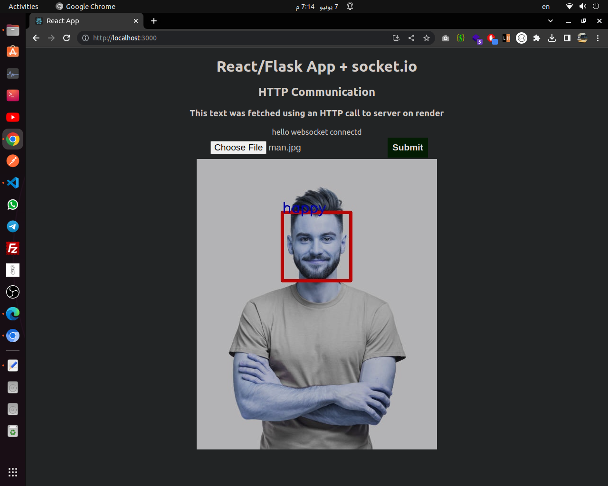
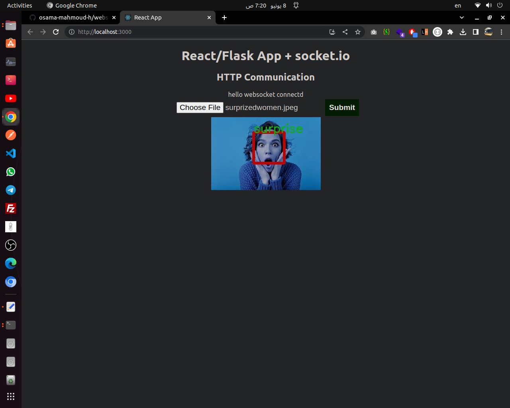
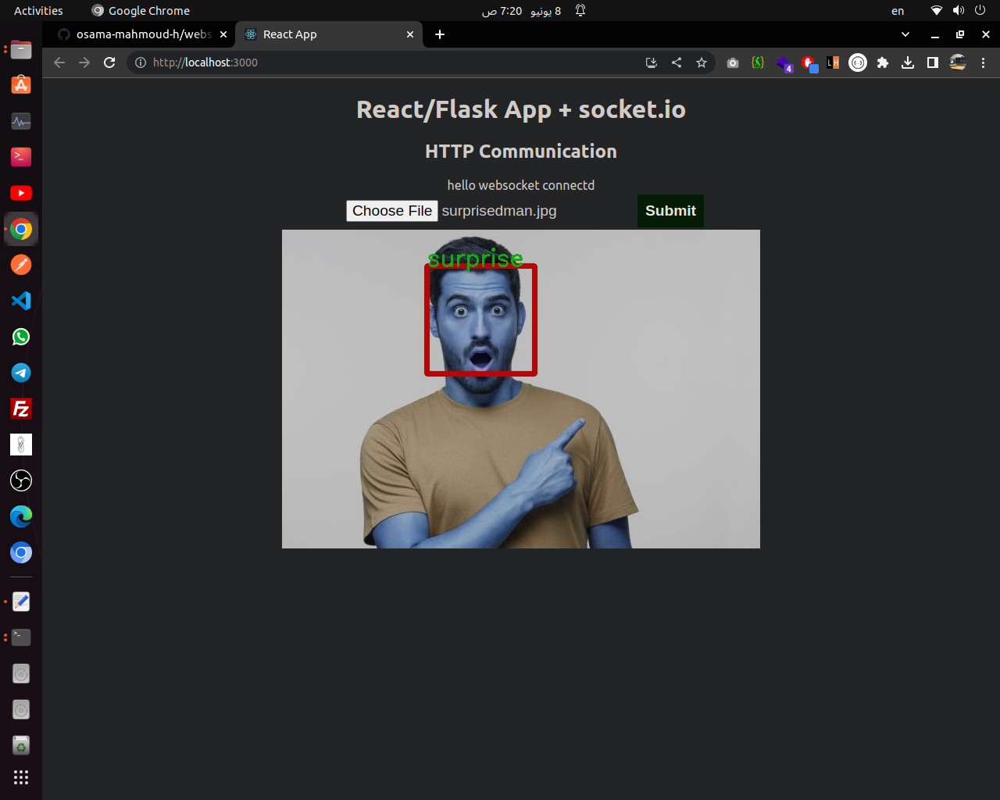

# Real-time Emotion detection (using flask server)
 
## using websockets (socket.io)

## client side untill now is just test

### TODO :(setup camera in client and send frames to server)

### mock examples:

